# PI_IN_THE_SKY

#### Gaby + Ellen 
#### *Blowing stuff up*


## Table of Contents
* [Planning](#Planning)
* [Schedule](#Schedule)
* [Project progression p1](#Project_progression_p1)
* [Code 1](#Code_1)
* [Code Review](#Code_Review)
* [Code 2](#Code_2)
* [Code Review 2](#Code_Review_2)
* [Failed Launch Photos](#Failure_Flics)
* [Failure Flics](#Failure_Flics)
* [Launch 3 Results](#Launch_3_Results)


## Planning


### What materials will you need and how much?  

#### We will likely need to use 3d printing material, acrylic, a midpower rocket motor, a guiding system, an altimeter, a thermometer, a Rasberry pi board, a launch site off of school grounds, and lastly, a small camera.   

### What do you still need to learn for your project?

#### We will need to learn how to code readings from a thermometer and altimeter to be seen in real-time on the ground. We will also need to learn how to design a rocket to survive high altitude and pressure along with its instruments.

### What is the definition for "success" in your project? 

#### For us to consider our project succesful we must capture altitude, temperature, and video of the launch. Our main safety concern will be the launch itself; we will have to launch at a secondary location to prevent any harm to surrounding buildings.

### Scope

#### We have gained knowledge over the past four years of engineering to make this project plausible. There is still a lot we have to learn for this project. We will have to further our coding knowledge and learn how to design a lasting rocket. There will also be lots of math calculations to determine the max weight. With all we already know, and what we have to learn, this project is perfect for testing our limits while also being able to complete the assignment.

### Risk Mitigation

#### To mitigate risk, we will have to launch the higher engine prototypes and final rocket in a field not at the school to allow a safe launch that doesn't affect other people or things. We will also discuss designs that effectively survive at high altitudes and pressure to preserve equipment and minimize fallout. Lastly, we will have a safely executed liftoff without overly excessive explosions/fire

### Schedule

#### -December 14th, build a test rocket and launch on block day
#### -Jan 3rd, start cad for E rocket, research code for active thermometer and altimeter
#### -January 25th, Have cad finished for a E rocket/Have code started 
#### -February 15th, have code done for thermometer
#### -March 1st, have code done for altimeter
#### -March 15, have code for active readings on ground during launch
#### -March 29, have E rocket cad printed/cut/assembled 
#### -April 12, launch and readings
#### -April 19, several successful launches with readings
#### -April 26, Compile recording and documentation
#### -Have rocket and final launch complete April 30th 2023
#### -Do any final tweaks
#### -Project due May 19th 2023

## First test launch/What went wrong

#### When building this A motor model rocket, we were initially not going to launch it and were making it as a prototype for our final project and to get a feel for missiles. That being said, when we decided to launch the rocket, we started using superglue to be more durable and stable for launching. The original glue and superglue did not withstand the launch, and the engine shot out the back of the rocket while in the air. The parachute was packed in too tightly and not connected to the missile, so it didn't deploy, and after losing the engine, the rocket plummeted to the ground and landed on its nose. 


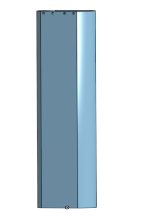

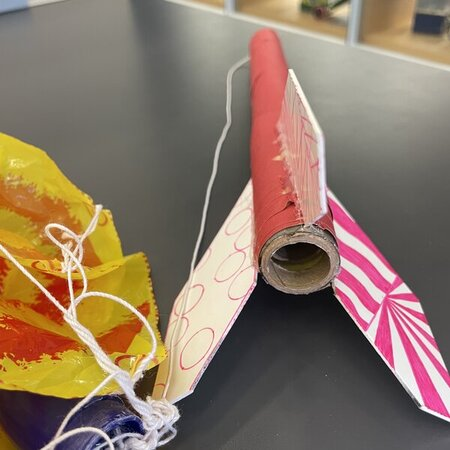


## Block Diagram

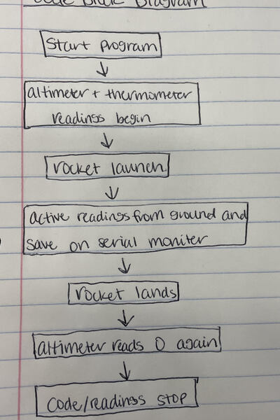


## Planned Designs/Ideas

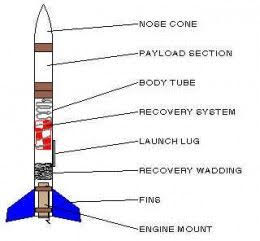

## Project_Progression_p1

#### ***We knew we had a lot to get done in a short period of time. Due to our flight field restrictions we had to find a safe launch site that was large enough to safely launch our rocket. We had difficulty finding a place to launch that wouldnt require a membership or require 100$ for a shitty field that was nowhere near the required size. This resulted in us reaching out to a friend who lives in christanburg who lives on a farm. He had some date restrictions as he was leaving for varius trips meaning the time we had to complete our project was signifcantly shorter than expected. Our orriginal planned schedule was nowhere near the reality of our projects timeline. Below is the rough timeline of start to finish.***

### Schedule

#### -December 14th, build a test rocket and launch on block day.
#### -January 3rd, start cad for E rocket, research code for active thermometer and altimeter additionally relaized that we had a very short time constazint and at this point we had to get shit done.
#### -January 9th, quickly threw together wiring.
#### -January 15th, Had rocket completed and spent a lot of afterschool and BKT's working.
#### -January 18th, Realized we did not plan enough and had to build our own massive launch pad.
#### -January 27th, Had launch pad completed and spent more time finishing code and general tweaks.
#### -Febuary 6th, Wiring had to be tweaked and we forgot that the pico would have to be able to save when collecting data.
#### -Febuary 11th, Drove up to christiansburg for the 'final' launch.

## Project Progression Continued 

#### We built a capsule to hold our wiring which is shown below. We printed a smaller version for testing purposes then printed the final for our rocket. There were no major issues with this and it was the first thing we finished.

                                                              
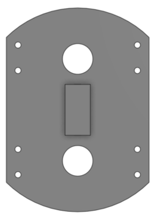

##### ***Im not even going to lie we were terrible at documentation towards the beginning of the project. We were super busy and documenting was the last thing on our mind. This bit us in the ass big-time later on.***

#### Next we needed to do our wiring and coding. Ellen was primarily on coding and I (Gaby) was in charge of the wiring and soldering. Mistake number 1, when I was wiring I had a random diagram on a random piece of paper. That paper was then lost which is why the original wiring diagram will not be in this github. This is the wiring diagram that we drew when we had to redo our circuitboard (***We'll get to why that is later***). (WE LOST IT AGAIN!!!!!)

### Diagram 
[Click here](https://github.com/gdaless20/PI_IN_THE_SKY/blob/main/urmom/deeznuts.pdf)
### Code_1

``` python
import time #imports
import board
import digitalio
import adafruit_mpl3115a2
import busio
import random

button = digitalio.DigitalInOut(board.GP16) #adds in the button
button.direction = digitalio.Direction.INPUT
button.pull = digitalio.Pull.UP #incorperates the button into the circuit
sda_pin = board.GP0  #sets up i2c
scl_pin = board.GP1
i2c = busio.I2C(scl_pin, sda_pin)
sensor = adafruit_mpl3115a2.MPL3115A2(i2c) 

time_list = []
altitude_list = []  #sets it up so values are read in lists (organization)
temperature_list = []
new_data = 0

led = digitalio.DigitalInOut(board.LED) 
led.direction = digitalio.Direction.OUTPUT  # if we have code working and power going to the raspberry pi the onboard led will turn on, our way of eyeball checking our code is working/on
led.value = True 

while True: #if the button/switch is pressed this will happen


     if button.value == False:
         if new_data == 0:
            data_time = time.monotonic()
            new_data = 1
         altitude = sensor.altitude #read altitude
         altitude_list.append(sensor.altitude)
         print("Altitude: {0:0.3f} meters".format(altitude)) #print altitude readings
         temperature = sensor.temperature
         temperature_list.append(sensor.temperature) #saves values for collection later
         print("Temperature: {0:0.3f} degrees Celsius".format(temperature))
         time_list.append(time.monotonic())
         time.sleep(1.0) #make it easier to read vaues if it doesn't write them every second, more organization
         
         if time.monotonic()-data_time>20: # CHANGE THIS must take less than this time to launch after switch flipped
            if abs(altitude_list[-1]-altitude_list[-10])<2: # CHANGE THIS rocket has landed
               break   #stop code taking values
#

#store data to pico in csv
print(time_list)
print(altitude_list)
print(temperature_list)

with open(f"/{int(1000*random.random())}.txt", "a") as datalog:
        for i in range(len(time_list)):
            input_values = f" {time_list[i]}, {altitude_list[i]}, {temperature_list[i]}"
            datalog.write('{}\n'.format(input_values))  #save all time, altitude, temperature values in seperate lines in pico
            datalog.flush()
#

```

### Code_Review

Coding is not for the weak, it takes a lot of time and frustration and Gaby had to bribe me with food so that she could do cad instead. In the begininning I had no idea how to code, we started out working on the "individual" assignments together as a team because Gaby could wire and I would mess around with the code until it worked; but we still didn't really understand or know how to do it. When we first planned out our rocket project we decided that using Raspberry PI and pico would be the best way to get a good grade and make our rocket read values. We originally thought of using an altimeter and a thermometer so we could see the temperature as it launched into the sky and could see how high it went at what speed. After putting in around 1 minute worth of research we realized an altimeter could read temperature, altitude and pressure- something almost everyone else knew but whatever. So we ended up using an altimeter, pico, and raspberrypi. 

Now for the juicy stuff:

In order to save code to our pico when it wasn't attatched to a computer we decided to use ****boot.py**** . This would essentially 
allow us to either write and save code OR read and take values while saving/collecting them for later viewing. The way you could do this on a normal circuitboard would be to use a single wire and take one end out or put it back in for whichever function you needed. As ours was in a rocket we couldn't do that, and decided to use 2 wires attached to a swtich. When the switch was flipped one way we would be in code mode and could write and save code as we pleased (this is also how you see the values you captured while running). When flipped the other way we woud run and save the code to the pico. In order to see the values captured you have to be in code mode and plug the pico into a computer. Open files and in the circuitpy folder you should find a file titled by a random 3 digit number (261, 883, 448) that contains all the readings. Something important to remember is when flipping, you need to flip to data mode either before you unplug from the computer or before you add the battery. You can't change from code mode to data mode while there is power running to the pico, if you do that you won't actually change modes and your values will not save. 

I set up our code so that our data values would save to the pico as lists for easier organization and viewing later on with our final launch values. This was a rather good idea and we kept that idea when we later adjusted the code after the first launch (more details on that later). A not as great idea was having a timer on our rocket's code. We decided that instead of sifting through potentially 1000 values, though more likely several hundred, we would create a time frame for when the code would start and stop. This was convenient because if our rocket reached the high altitudes we were hoping for (it did not), then it could potentially take us a while to get to the rocket and turn the code off. To save us from all the useless values of no change once the rocket had landed, I coded it so that after 10 full values of no change in altitude the code would automatically turn off. During out tests and practice runs at the lab we would use much shorter time increments, hence the CHANGE THIS, because that would have been disastrous if I forgot to change it before our big launch. 
``` python
if time.monotonic()-data_time>20: # CHANGE THIS must take less than this time to launch after switch flipped
            if abs(altitude_list[-1]-altitude_list[-10])<2: # CHANGE THIS rocket has landed
               break   #stop code taking values
```
That would have been great except that we needed more than 10 seconds between flipping the Run switch and the rocket launching. We had to pack the rocket, get the drone in the air, close the capsule, attach the alligator cables and push the pin, which would never take only 10 seconds. So, to resolve this issue I made it so that we would have 6 minutes between the switch being flipped and the code starting to run which should have been plenty of time. However nothing runs smoothly for us, and there were many hiccups so we ended up launching with only 22 seconds left. Come to think of it, that could have been an issue with not getting any code from our launch, the seconds left would have made it wait 23 seconds before running the code and I don't think our launch lasted over 40 seconds, potentially a minute tops. However our battery was obliterated along with our circuitboard and capsule (and the rest of the rocket too I suppose) and that would make our code not work either. 


### Code_2


``` python
import time #imports
import board
import digitalio
import adafruit_mpl3115a2
import busio
import random

button = digitalio.DigitalInOut(board.GP16) #adds in the button
button.direction = digitalio.Direction.INPUT
button.pull = digitalio.Pull.UP #incorperates the button into the circuit
sda_pin = board.GP0  #sets up i2c
scl_pin = board.GP1
i2c = busio.I2C(scl_pin, sda_pin)
sensor = adafruit_mpl3115a2.MPL3115A2(i2c) 

time_list = []
altitude_list = []  #sets up lists
temperature_list = []
new_data = 0

led = digitalio.DigitalInOut(board.LED) 
led.direction = digitalio.Direction.OUTPUT 
led.value = True 

while True: #if the button/switch is pressed this will happen


     if button.value == False:
         if new_data == 0:
            data_time = time.monotonic()
            new_data = 1
         altitude = sensor.altitude #read altitude
         altitude_list.append(sensor.altitude)
         print("Altitude: {0:0.3f} meters".format(altitude)) #print altitude readings
         temperature = sensor.temperature
         temperature_list.append(sensor.temperature) #saves values for collection later
         print("Temperature: {0:0.3f} degrees Celsius".format(temperature))
         time_list.append(time.monotonic())
         time.sleep(1.0)
         
         if time.monotonic()-data_time>20: # CHANGE THIS must take less than this time to launch after switch flipped
            if abs(altitude_list[-1]-altitude_list[-10])<2: # CHANGE THIS rocket has landed
               break   #stop code taking values
#

#store data to pico in csv
print(time_list)
print(altitude_list)
print(temperature_list)

with open(f"/{int(1000*random.random())}.txt", "a") as datalog:
        for i in range(len(time_list)):
            input_values = f" {time_list[i]}, {altitude_list[i]}, {temperature_list[i]}"
            datalog.write('{}\n'.format(input_values))  #save all time, altitude, temperature values in seperate lines in pico
            datalog.flush()
            
```


### Code_Review_2

This code was essentially the same as the first code we used on our original launch. We still used boot.py and put our data in lists but the primary change was made due to the way we had no data after our first launch failed and shot into the ground at 20 mph. The data could have been lost due to the lack of power  going to the code, the massive brute impact of the pico hurtling into the ground at a high speed, or even human error when setting up the rocket for launch with switches or a wire coming loose. To help eliminate the lack of data even if a launch completely fails again, I made it so that the data values captured would immediately save to the pico at each reading instead of saving at the end. Now even if our rocket fails horribly again, we will have the values of it's final flight. I made sure the flight values would still save in lists but I also eliminated the countdown that stressed us out the first launch. We had a whole six minutes to launch which should have been plenty of time but still, it's me and gaby and who knows what could go wrong but obviously anything. To eliminate that stress I made it so that the code would start running immediately after flipping the run switch. This also results in an operator change, you now should have power going to the pico when you flip the run switch. Now there isn't a timer to delay our code and yes, the code will have a lot of unnecessary numbers from the beginning and end of the launch but we can time when we actually launch the rocket to sift through the beginning values and the end should be easy to tell when the rocket landed. These two changes made our rocket code effectively foolproof, regardless of rocket destruction or poor time management on rocket launch we would have values after.

### Final Rocket 
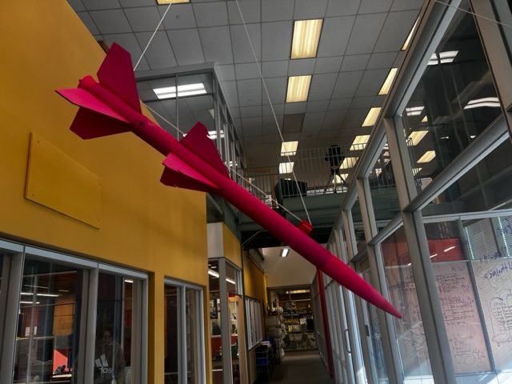


### Failure_Flics

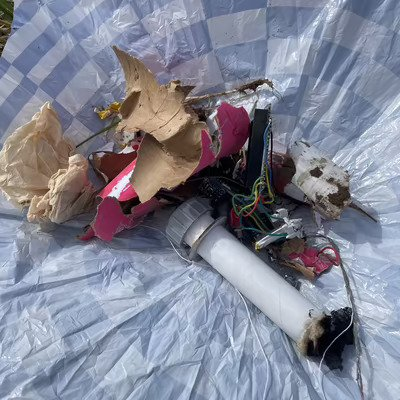
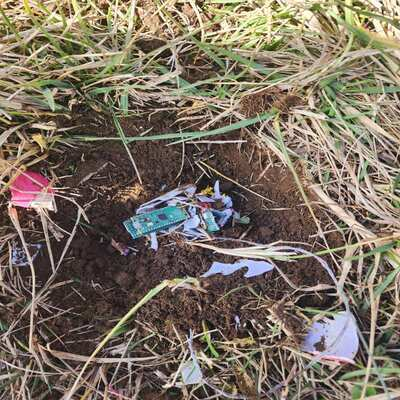
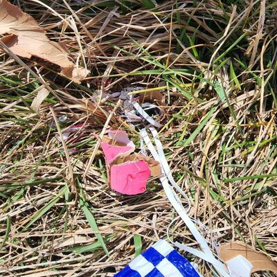
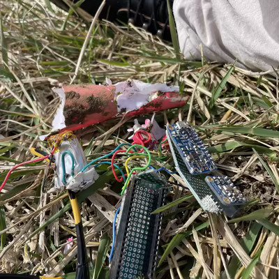
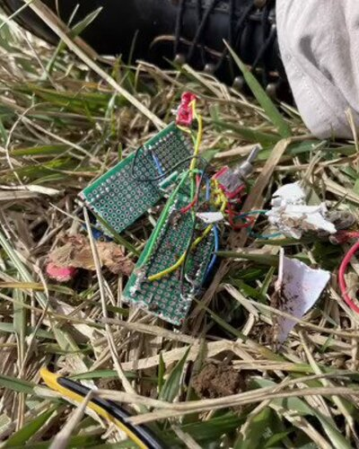
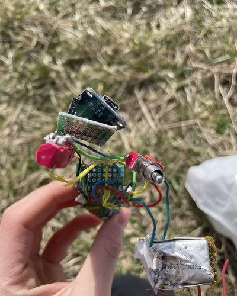


### Unpacking_the_Big_Launch

Alright, so by now you've realized our "Big Launch" didn't exactly go to plan and it's time to unpack what happened. Launch day was beautiful, very slight breeze, early morning around 10:30, lightly chilly. We arrived to the farm and set up in a massive field with a very large hill and surrounding forest. Our rocket was ready, we were ready, we even had an audience watching us. Clearly we hadn't practiced launching the rocket before because the set up took us forever and we kept running into issues, either with the drone not wanting to work, no viable filming set ups, and even packing the rocket was a struggle. We were trying to pack so much into this thin rocket shaft and not only was it difficut, it took a good amount of time so as I was shoving things down the body of the rocket trying to fit everything there was a countdown going on making everything more crazed and insane. However, we did manage to launch the rocket in time and it shot up beautifully, slightly tilted up the hill and away from the road because our round was not fully level though we did our best. It gained altitude incredibly fast but after a moment (10 seconds we later realized) the rocket ceased it's acceleration and instead began to plummet down, much to our surprise, dissappointment and confusion. However, only a moment later the second motor ignited and the rocket did a full loop-de-loop before shooting directly into the ground nose first.  Our circuitry was destroyed and the rocket was destroyed as well. That launch left us frustrated and without a working rocket. 


### Launch_3_Results

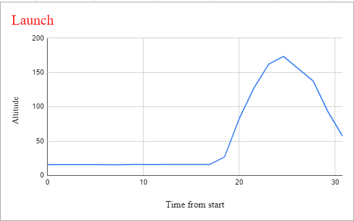


Our final launch went really well and all of our code and ciruitry worked perfectly and survived the rough landing (parachutes suck).
Super excited that we got such great values, went up to 173 meters which is 567.5 feet which was a great way to top off our project for the year. Our rocket flew high and pretty straight for the most part until the descent, which was a relief because when we did our second launch with wimpy B motors at the school we went up like 8 feet and two of our fins broke off so when it was time to launch this time we ripped off the remaining fins so it wouldn't go off course. Our first launch was with two E motors, the second was with B motors and the final was with D motors. 


### Final_Takeaways

This project definitely challenged us in so many ways and we worked on patience and to cooperatively work with other peoples' schedules, whether it was for the launch date at the farm, or when Gaby and I were availbale to go launch. Gaby did the first circuitboard and when it was obliterated I made the second one, teaching us both soldering and a bit of wiring as well. I really learned how to code and it was less intimidating than I expected and thought it to be at the start of the year. Our code was affective and efficient and our values were perfect so our project finished very well because our Pi in the Sky had values. The amount of teamwork that went into this project was insane, as Gaby and I were constantly working together and making things a 2 person job, with Mr. Miller's help with code and random things that went wrong, as my coding problems simply couldn' t be the usual suspects but instead complex outlandish things neither of us had encountered before. 

### Final_vlog

https://youtu.be/cSt94-9AS5c

***This includes launch videos and other important run throughs***
