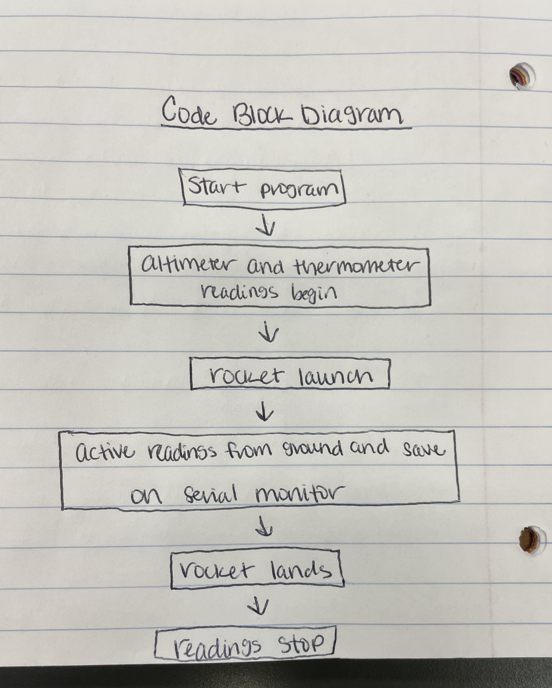

# PI_IN_THE_SKY

#### Gaby + Ellen 
#### *Blowing stuff up*

## Planning

### What materials will you need and how much?  

#### We will likely need to use 3d printing material, acrylic, a rocket motor, a guiding system, an altimeter, a thermometer, a Rasberry pi board, a launch site off of school grounds, and lastly, a small camera.   

### What do you still need to learn for your project?

#### We will need to learn how to code readings from a thermometer and altimeter to be seen in real-time on the ground. We will also need to learn how to design a rocket to survive high altitude and pressure along with its instruments.

### What is the definition for "success" in your project? 

#### For us to consider our project succesful we must reach a minimum altitude of 800ft, capture altitude, temperature, and hopefully a video of the launch. Our main safety concern will be the launch itself; we will have to launch at a secondary location to prevent any harm to surrounding buildings.

### Scope

#### We have gained knowledge over the past four years of engineering to make this project plausible. There is still a lot we have to learn for this project. We will have to further our coding knowledge and learn how to design a lasting rocket. There will also be lots of math calculations to determine the max weight. With all we already know, and what we have to learn, this project is perfect for testing our limits while also being able to complete the assignment.

### Risk Mitigation

#### To mitigate risk, we will have to launch the higher engine prototypes and final rocket in a field not at the school to allow a safe launch that doesn't affect other people or things. We will also discuss designs that effectively survive at high altitudes and pressure to preserve equipment and minimize fallout. Lastly, we will have a safely executed liftoff without overly excessive explosions/fire

### Schedule

#### -December 14th, build a test rocket and launch on block day
#### -Jan 3rd, start cad for E rocket, research code for active thermometer and altimeter
#### -January 25th, Have cad finished for a E rocket/Have code started 
#### -February 15th, have code done for thermometer
#### -March 1st, have code done for altimeter
#### -March 15, have code for active readings on ground during launch
#### -March 29, have E rocket cad printed/cut/assembled 
#### -April 12, launch and readings
#### -April 19, several successful launches with readings
#### -April 26, Compile recording and documentation
#### -Have rocket and final launch complete April 30th 2023
#### -Do any final tweaks
#### -Project due May 19th 2023

## First test launch/What went wrong

#### When building this A motor model rocket, we were initially not going to launch it and were making it as a prototype for our final project and to get a feel for missiles. That being said, when we decided to launch the rocket, we started using superglue to be more durable and stable for launching. The original glue and superglue did not withstand the launch, and the engine shot out the back of the rocket while in the air. The parachute was packed in too tightly and not connected to the missile, so it didn't deploy, and after losing the engine, the rocket plummeted to the ground and landed on its nose. 

## Block Diagram

